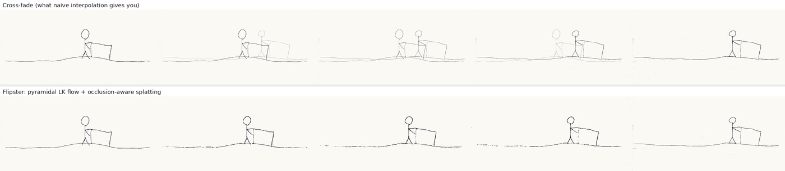
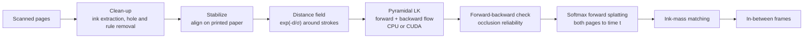

# Flipster

**Turn a hand-drawn flipbook into smooth animation.** Flipster reads scans of notebook pages (or pages you draw in the
browser), tracks every pencil stroke from one page to the next with dense **pyramidal Lucas–Kanade optical flow**
written in **C++/OpenMP and CUDA**, and draws the in-between frames with **occlusion-aware forward splatting**.

<p align="center"></p>

<p align="center"></p>

| | |
|---|---|
| **Frontend** | React 19 · TypeScript · Vite · Tailwind CSS · TanStack Query · dnd-kit · Vitest |
| **Backend** | FastAPI · background job queue · server-sent-event progress · GIF/MP4 export |
| **Compute core** | C++17 + OpenMP, CUDA 12 kernels, pybind11 bindings, scikit-build-core, GoogleTest |
| **Tooling** | Docker (CPU and CUDA images) · GitHub Actions (Linux + Windows C++, CUDA compile, Python, web, Docker) · ruff · oxlint |

---

## How it works



1. **Clean-up (Python/OpenCV).** Ink strength is darkness of `max(R,G,B)` against a local paper-brightness estimate, so
   blue ruled lines, lighting gradients and blue stains disappear. The red margin (which scanners darken) is removed by
   subtracting the colour a thin line adds over its surroundings. Binder holes, specks and haze are dropped.
2. **Stabilize.** Pages are hand-traced, so aligning on the ink drifts. Affine ECC read the character's walk as a page
   stretch, and phase correlation on the ink gave shifts of up to 110 px. The *printed paper*, though, is identical on
   every page, so the colourful structure is projected onto each axis and the 1-D profiles are cross-correlated. On the
   bundled scans this recovers the 4–14 px margin offsets exactly.
3. **Distance-field input.** A 2 px pencil line gives a 15×15 LK window almost nothing to work with. Flow is computed
   on `exp(-distance_to_ink / σ)`, which turns each stroke into a wide, smooth ridge.
4. **Dense pyramidal Lucas–Kanade** (the part in C++ and CUDA, [`core/`](core)):
   - Gaussian pyramid (5-tap binomial). Coarse-to-fine with ×2 flow upsampling. 3× more iterations at the coarsest
     level. 3×3 median after each level.
   - Each iteration warps `I1` by the current flow and solves one 2×2 system per pixel from windowed normal equations.
     The residual is **linearized around each pixel's own flow**, `I1(y+d) ≈ I0(y) + It(y) + ∇I(y)·(d − u(y))`, which
     makes the update a structure-weighted average of neighbouring flows. The naive `box(∇I·It)` update amplified
     high-frequency noise and diverged within ~20 iterations.
   - Samples that fall outside `I1` are **masked out** of both sides of the normal equations.
   - **Levenberg–Marquardt damping** scaled by the window's gradient energy, so every pyramid level converges at the
     same rate and flat windows stay stable.
5. **Synthesis.** Both pages are **forward-splatted** to time *t* (bilinear, atomics on the GPU) with
   **softmax weights** `exp(β·ink)` (Niklaus & Liu, CVPR 2020), so a moving stroke wins over the blank paper it lands on.
   Pixels that fail the **forward–backward consistency** check (Sundaram et al., ECCV 2010) get less weight, so strokes
   that appear or vanish fade instead of smearing. v1 used backward warping instead, which looks up the flow at the
   *destination* pixel. When a thin stroke has moved farther than its own width, that pixel is blank paper with no
   motion, so the stroke never moves. A final **ink-mass match** trims bilinear spill so in-betweens are the same
   weight as the pages.

The NumPy implementation in [`python/flipster/reference.py`](python/flipster/reference.py) is the executable spec. The
C++ and CUDA engines share every per-pixel formula through
[`core/src/common/pixel_ops.hpp`](core/src/common/pixel_ops.hpp) (`__host__ __device__` inline functions), and parity
tests hold all three backends to the same answer.

### CUDA engine

- One LK iteration is three launches:
  1. a **fused** warp + residual + normal-equation kernel that writes 5 planes,
  2. a box filter over all 5 planes at once,
  3. the per-pixel damped 2×2 solve.
- **Box filter.** The optimized path is separable:
  - The horizontal pass stages a 256-px row tile plus halo in **shared memory**.
  - The vertical pass is a **coalesced running sum**: each thread walks a column strip, and adjacent threads read
    adjacent addresses.
  - A naive 2-D global-memory variant is kept so the benchmark can show the difference.
- **Memory.** Device buffers are cached and grow-only, so repeated frames never hit `cudaMalloc`. `set_pair()` keeps
  both pages, flows and reliabilities resident, so N in-betweens cost N small splat launches.
- **Timing and parity.** Stages are timed with CUDA events (upload / pyramid / LK / download). The engine is built with
  `--fmad=false` so results stay comparable to the CPU engine.

## Where v1 went wrong

v1 was my 15-112 term project (Python + `cmu_graphics`, single-scale Lucas–Kanade). Rewriting it turned up three bugs,
each now pinned by a test in [`tests/test_legacy_bugs.py`](tests/test_legacy_bugs.py) against the original code in
[`legacy.py`](python/flipster/legacy.py):

1. **Flow was 8× too small.** `cv2.Sobel(ksize=3)` returns 8× the derivative while the temporal difference was
   unscaled. On a 2 px shift v1 estimated **0.25 px**, so the "optical flow" mode was really a cross-dissolve.
2. **The warp pointed the wrong way.** `remap(frame, grid + t·flow)` pushed both frames *away* from the midpoint (a blob
   moving 38 → 40 was drawn at 37 and 41 instead of 39).
3. **Single level, single iteration.** This only works for ~1 px of motion, which is why v1 shrank pages to 1/10 size.

It was also a per-pixel Python loop calling `cond()` and `pinv()`, estimated at ~105 s per flow field at 1080p on the
machine below.

## Performance

`python bench/run_bench.py` runs every backend on the same textured 1080p/720p/480p pair with a known 12.5 × −7.25 px
shift, so the table shows speed *and* end-point error. OpenCV's Farneback and DIS are included as familiar dense-flow
reference points (they are different algorithms).

Measured on a 2-vCPU cloud VM without a GPU ([bench/results/cloud-2vcpu.md](bench/results/cloud-2vcpu.md)):

| method | 480p | 720p | 1080p | EPE (px) |
|---|---|---|---|---|
| v1 (15-112) Python loop | ~14.4 s (est.) | ~46.9 s (est.) | ~104.9 s (est.) | — |
| NumPy reference (vectorized) | 345 ms | 1.1 s | 2.7 s | 0.045 |
| **C++ / OpenMP (2 threads)** | **71 ms** | **185 ms** | **459 ms** | 0.045 |
| OpenCV Farneback | 73 ms | 221 ms | 599 ms | 0.042 |
| OpenCV DIS (medium) | 26 ms | 70 ms | 178 ms | 0.045 |

**GPU numbers:** run `python bench/run_bench.py --sizes 480p,720p,1080p,4k --out bench/results/<your-gpu>.md` on a CUDA
machine. That adds rows for the optimized and naive CUDA kernels (kernel time via CUDA events, with PCIe copies in the
JSON). For per-kernel profiles, run `nsys profile build/flipster_bench --backend cuda` or `ncu --set full ...`.

**Accuracy:** run `python eval/middlebury.py --download --out eval/results.md`. It reports end-point / angular error
against Middlebury ground-truth flow, and PSNR / SSIM of the synthesized midpoint against Middlebury's ground-truth
interpolated frames. Methods compared: cross-dissolve, v1's backward warp (with its bugs fixed) and Flipster's
splatting. When vision.middlebury.edu is unreachable (common from cloud machines), it falls back to the copy of
Middlebury's RubberWhale sequence in OpenCV's test data, plus leave-one-out interpolation on two real video clips
from the same folder.

## Running it

### Google Colab (free NVIDIA GPU)

[](https://colab.research.google.com/github/lolaitan/Flipster/blob/main/notebooks/flipster_colab.ipynb)

[`notebooks/flipster_colab.ipynb`](notebooks/flipster_colab.ipynb) builds the CUDA engine on Colab's GPU, runs the C++
and Python suites (including CPU↔CUDA parity), benchmarks every backend up to 4K, runs the Middlebury evaluation,
renders the sample flipbook and can serve the web app through Colab's proxy. Pick *Runtime → Change runtime type → T4
GPU*, then *Run all*. The last cell downloads the results.

### Windows (one click)

Double-click **`scripts\windows\setup.cmd`**. It finds Python, creates `.venv`, builds the C++ engine with Visual
Studio's compiler (and the CUDA engine when an NVIDIA GPU and the CUDA Toolkit are present), builds the web app, runs
the tests, then opens http://127.0.0.1:8000. Without a C++ compiler it falls back to the NumPy engine, so the app
still runs. After that, `scripts\windows\run.cmd` just starts the app. The full log is in `data\setup\setup.log`.

### Docker

```bash
docker compose up                   # CPU build → http://localhost:8000
docker compose --profile gpu up     # CUDA build → http://localhost:8001 (needs the NVIDIA Container Toolkit)
```

### Local development

Requirements:

- Python ≥ 3.10
- CMake ≥ 3.20 and a C++17 compiler (GCC/Clang, or Visual Studio 2022 Build Tools on Windows)
- Node 22
- Optional: CUDA Toolkit 12.x. When `nvcc` is found, the CUDA backend is built automatically.

```bash
pip install -e ".[server,dev]"      # compiles flipster._core (CPU, + CUDA if nvcc is found)
uvicorn app.main:app --app-dir server --reload        # API on :8000

cd web && npm install && npm run dev                    # UI on :5173, proxies /api to :8000
```

Force a backend with `FLIPSTER_ENABLE_CUDA=ON|OFF pip install .`. Target only your own GPU with
`--config-settings=cmake.define.CMAKE_CUDA_ARCHITECTURES=native`.

**Windows + NVIDIA:** the simplest route is WSL2 (Ubuntu) with the CUDA toolkit for WSL, then the Linux steps above.
Native Windows works too: install Visual Studio 2022 Build Tools and the CUDA Toolkit, then run
`pip install -e .[server,dev]` from a *x64 Native Tools* prompt.

### Tests

```bash
pytest                                             # NumPy reference, native engines, parity, API
cmake -S . -B build -DFLIPSTER_BUILD_TESTS=ON && cmake --build build && ctest --test-dir build
cd web && npm test
```

On a CUDA machine, `ctest` also runs the CPU↔CUDA parity suite (optimized and naive kernels), and `pytest` includes
the `cuda` backend in every flow/synthesis test.

## Project layout

```
core/            C++17 / CUDA engine
  include/         public headers (Engine, FlowParams, images)
  src/common/      __host__ __device__ per-pixel math shared by both backends
  src/cpu/         OpenMP engine
  src/cuda/        CUDA engine + kernels
  tests/, tools/   GoogleTest suite, native benchmark
bindings/        pybind11 module (flipster._core)
python/flipster/ reference implementation, preprocessing, pipeline, export
server/          FastAPI app (projects, jobs, SSE, export) + API tests
web/             React + TypeScript app
bench/, eval/    throughput benchmark, Middlebury accuracy harness
samples/scans/   the 20 original notebook pages
docker/, .github/workflows/
```

## API

| method | path | |
|---|---|---|
| `GET` | `/api/system` | backends, GPU name, limits |
| `POST` | `/api/projects` | new project (`scan` or `drawing`) |
| `POST` | `/api/projects/{id}/frames` | upload pages (multipart) |
| `POST` | `/api/projects/{id}/samples` | load the bundled flipbook |
| `PUT` | `/api/projects/{id}/frames/order` | reorder |
| `POST` | `/api/projects/{id}/renders` | start a render → `job_id`, `render_id` |
| `GET` | `/api/jobs/{id}/events` | server-sent progress events |
| `GET` | `/api/renders/{id}` | frames, flow visualizations, timing summary |
| `GET` | `/api/renders/{id}/export?format=gif\|mp4` | download |

## Limitations

- Lucas–Kanade assumes locally smooth motion. Strokes that cross, rotate fast or change shape a lot between pages
  (limbs swinging) can tear. The consistency check turns those into a fade instead of a smear.
- Motion along a perfectly straight stroke is unobservable (the aperture problem). Such strokes take the motion of
  their surroundings.
- The scan clean-up is tuned for pencil or dark pen on ruled notebook paper.

## References

- B. D. Lucas and T. Kanade, *An Iterative Image Registration Technique with an Application to Stereo Vision*, 1981.
- J.-Y. Bouguet, *Pyramidal Implementation of the Lucas Kanade Feature Tracker*, Intel, 2000.
- S. Baker and I. Matthews, *Lucas-Kanade 20 Years On: A Unifying Framework*, IJCV 2004.
- N. Sundaram, T. Brox and K. Keutzer, *Dense Point Trajectories by GPU-Accelerated Large Displacement Optical Flow*,
  ECCV 2010.
- S. Niklaus and F. Liu, *Softmax Splatting for Video Frame Interpolation*, CVPR 2020.
- S. Baker et al., *A Database and Evaluation Methodology for Optical Flow*, IJCV 2011 (Middlebury).

MIT licensed.
